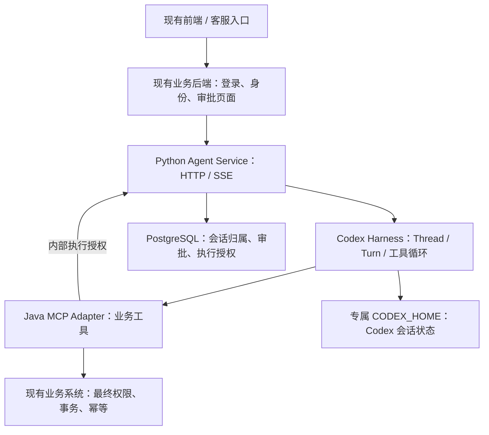

# 企业业务 Agent 开发底座 · Codex Harness

把 Agent 接入已有的 Java / ERP / OMS / CRM 系统，复用会话、执行授权、流式接口和评测基础设施，按业务开发 Skill、Tool、Policy 与验收题库。当前以**订单 / 售后 Agent**作为参考实现。

**当前状态：可进入隔离测试环境联调；尚未完成生产上线验收。** 它是可复用的工程基线，目前还不是发布好的通用 SDK，也不是多 Agent 管理平台。订单装配仍在代码中，换业务需要开发适配层，不能只改一个 `AGENT_ID`。

## 仓库结构

| 目录 | 职责 |
|---|---|
| `codex-agent-python/` | Agent 服务主体：HTTP/SSE、会话归属、Codex App Server 接入、审批与执行授权、评测 |
| `order-mcp-adapter/` | Java 订单工具适配服务：暴露查询/取消工具，校验执行授权，通过 Gateway 调用已有 OMS |
| `.github/workflows/` | Python 与 Java 的持续集成测试 |

Python 服务通过 SDK 启动和控制 Codex App Server；Codex 通过 MCP 调用 Java 的订单工具。Java 在取消订单前向 Python 申请执行授权，再调用 OMS。两个目录共同构成当前订单参考实现；前端和真实 OMS 由接入方提供。Java 模块可独立部署。

## 从这里开始

| 你要做什么 | 阅读入口 |
|---|---|
| 第一次启动、查询测试订单 | [上手指南](codex-agent-python/docs/GETTING_STARTED.md)：准备环境 → 启动依赖 → 创建会话 → HTTP/SSE |
| 接入已有公司项目、开发第二种业务 Agent | [系统接入与复用指南](codex-agent-python/docs/INTEGRATION.md)：身份、接口、审批、扩展位置 |
| 理解意图识别、上下文、记忆及框架差异 | [Codex Harness 与 AgentScope 对比](codex-agent-python/docs/HARNESS_COMPARISON.md) |
| 查看 Python 配置、API、排障 | [Agent Service README](codex-agent-python/README.md) |
| 接入 Java 业务系统 | [Order MCP Adapter README](order-mcp-adapter/README.md) |
| 验证 Agent 效果与安全 | [LangSmith Eval 指南](codex-agent-python/evals/README.md) |
| 判断能否上线 | [验收清单](codex-agent-python/docs/PRODUCTION_READINESS.md) · [可靠性边界](codex-agent-python/docs/RELIABILITY.md) · [执行幂等契约](codex-agent-python/docs/EXECUTION_CONTRACT.md) |

## 它在现有系统中的位置



推荐以独立服务接入，已有 Java 系统通过 HTTP/SSE 调用 Agent，业务能力通过 MCP 暴露。已有系统仍拥有账号、订单、权限和事务；不需要把整个业务后端迁到 Python，也不需要在 Java 再启动一套 Codex。

## 我们已经确定的架构原则

1. **业务内容由团队开发**：Skill 定义 SOP 与澄清规则，Tool/MCP 提供真实能力，Policy 约束权限，Eval 判断业务效果。
2. **推理循环交给 Harness**：Codex 管理模型与工具往返、Thread/Turn、上下文及压缩。本仓库的 `CodexRuntime` 是适配器。
3. **执行安全由程序和业务系统保证**：模型选择工具不等于获得授权；人工批准也不替代 OMS 的租户、资源权限和状态校验。
4. **状态各有归属**：Codex 保存会话状态；PostgreSQL 保存会话归属与审批；订单事实回源 OMS。长期用户记忆、RAG 是独立需求。
5. **复用先于平台化**：先复用模块和工程规范；真正出现多个业务的重复需求后，再抽取版本化公共包。多 Runtime、Registry、Scheduler 尚未实现。

## 已实现什么，能复用什么

| 能力 | 已有实现 | 复用边界 |
|---|---|---|
| Runtime 适配 | `AgentRuntime` Protocol、Codex SDK 适配、事件映射 | 更换运行时需另写实现并验证语义；不是配置即切换 |
| 会话归属 | `conversation_id` 映射 Thread，校验 user + tenant | 前端只保存业务会话 ID；运维快照接口另有权限 |
| 并发与失败边界 | 同会话互斥、总并发限制、执行期限、排空 | 单进程有效；同会话冲突 409、容量满 503 |
| HTTP/SSE | 安全事件、有界订阅、客户端断线后后台继续执行 | 无历史重放、断点续传或完成结果查询型任务系统 |
| 高风险操作 | 操作注册、参数绑定、持久化审批、固定 execution ID | 业务校验器需单独开发；OMS 仍须原子去重 |
| 运行限制 | READ_ONLY、本地工具限制、launcher 清理环境 | 当前仅适合通过 MCP 执行业务；不是任意代码执行的隔离环境 |
| 数据库可靠性 | 连接/SQL/锁等待期限、后台 readiness、异常安全码 | 部署容量、备份、故障恢复仍需验收 |
| 审批接入 | 分页、会话/状态筛选、跨租户隔离 | 需要现有系统提供审批 UI；未实现职责分离、多人会签 |
| 评测与观测 | LangSmith Target/Evaluator/门禁、OTel Trace | 真实模型实验、告警与业务质量阈值需要落地 |

新 Agent 通常需要更换：**Skill、Tool 合约、MCP Adapter、业务授权校验器、模型/运行策略及题库**。公共接口、可靠性控制、授权骨架与评测方式可以继续复用。具体文件见[接入指南](codex-agent-python/docs/INTEGRATION.md)。

## 快速开始

参考环境：Python 3.11+、JDK 21、Maven、PostgreSQL 16、可用的 Codex 模型认证。完整链路还需要测试 OMS；仓库提供只读测试 fixture，可先验证查订单和恶意工具返回场景。

```bash
git clone https://github.com/LiuYuPeng1101/codex-agent-foundation.git
cd codex-agent-foundation/codex-agent-python
python3 -m venv .venv
. .venv/bin/activate
python -m pip install -e '.[dev,eval]'
ruff check app tests evals
pytest
```

这段只安装依赖并运行代码测试。未配置 `TEST_DATABASE_URL` 时，PostgreSQL 测试会跳过；**测试通过不表示服务已启动或真实模型已验收**。启动数据库、配置密钥、启动 Java/Python 和首次 API 调用请按[上手指南](codex-agent-python/docs/GETTING_STARTED.md)执行。

## 意图、上下文、记忆，分别归谁管

| 问题 | 本项目当前做法 |
|---|---|
| 用户想查订单还是取消订单？ | 模型结合用户输入、Skill、会话上下文及 Tool 描述选择动作；没有独立的意图分类服务 |
| “把刚才那个订单取消”里的“那个”是谁？ | 同一 conversation 恢复同一 Thread，由模型使用上下文理解；不明确时应澄清 |
| 聊天太长怎么办？ | 使用 Codex 的上下文压缩；已有手动压缩接口，真实效果仍需验证 |
| 重启后还能接着聊吗？ | 恢复需要 PostgreSQL 映射与原 CODEX_HOME；机制已接入，灾难恢复尚未演练 |
| 新会话是否自动记住这个客户？ | 未实现租户隔离的跨会话业务记忆，不能据此承诺 |
| 订单是否已取消？ | 查询 OMS，以业务事务记录为准，不能把模型回答或审批 CONSUMED 当作成功凭证 |

Codex 当前官方能力与仓库锁定版本并不完全等同；AgentScope Java 也有自己的 HarnessAgent、压缩和长期记忆机制。详细来源和区别见[机制对比](codex-agent-python/docs/HARNESS_COMPARISON.md)。

## 当前部署限制

- 一个 Agent Service 进程、一个事件循环、一个 Codex Runtime，`--workers 1`，部署副本为 1；可服务多个独立会话。
- CODEX_HOME 使用专属持久目录，禁止两个 Runtime 同时写入；发布先停止旧实例，再启动新实例。
- 公共 API 当前采用服务密钥 + 可信身份 Header；只供可信后端调用，不能把密钥交给浏览器或小程序。
- 通用 SDK 适配、会话持久化不能自动保证跨租户文件、长期记忆或部署层隔离；必须按清单验收。
- 暂无多 Runtime 路由、企业长期记忆服务、通用工作流引擎和开箱即用的前端审批台。

## 接下来按什么顺序做

1. 跑通真实模型 → MCP → 测试 OMS 的查询和审批执行链。
2. 验收 OMS 原子幂等、并发重放与提交后响应丢失。
3. 运行完整 LangSmith 实验，关键用例不能失败或跳过。
4. 验证身份、密钥、跨租户记忆/文件/网络边界。
5. 演练重启恢复、备份恢复、发布排空、SSE 代理和容量告警。

不再把已完成的会话互斥、并发限制、Java CI 修复列为缺失项。每项状态、证据和上线门槛统一维护在[验收清单](codex-agent-python/docs/PRODUCTION_READINESS.md)。

## 最近更新

- **2026-09-25，目录整理**：Java 模块目录统一为 `order-mcp-adapter/`；同步 CI、启动步骤和接入文档，仓库链接更新为 `codex-agent-foundation`，新增目录职责说明。已有工作区更新后请使用新目录执行 Maven 命令。

- **2026-09-21，文档整理**：明确公司复用定位；新增上手、系统接入和 Harness 对比指南；重写验收清单，纠正旧状态。未升级依赖或声称完成新的生产验收。
- **2026-09-06，PR #20 已合并**：执行授权和固定幂等 ID、运行环境清理、数据库超时与 readiness、审批分页、fixture 验证及完整 MCP HTTP 测试。该提交 CI：Python 88 项、Java 10 项通过，见[历史验证记录](https://github.com/LiuYuPeng1101/codex-agent-foundation/actions/runs/34025590904)。
