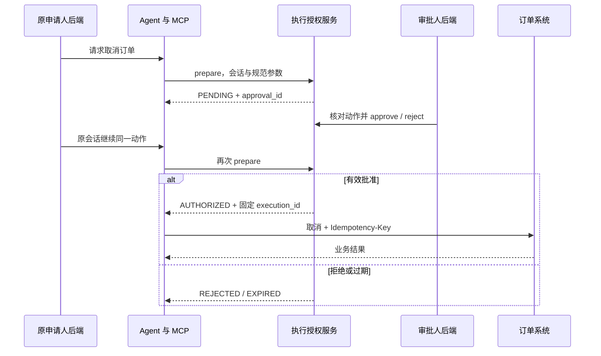

# 接入现有系统与复用开发

[项目首页](../../README.md) · [首次启动](GETTING_STARTED.md) · [运行机制对比](HARNESS_COMPARISON.md)

目标是让公司下一次开发 Agent 时，复用已验证的工程机制，将主要精力放在业务能力及验收上。当前仓库是参考工程，尚未提供独立发布的公共包、自动脚手架或多 Agent 注册机制。

## 1. 接入方式：保留现有业务系统

推荐在现有系统后端旁部署 Agent Service。现有前端增加一个会话入口和审批入口；已有后端负责身份认证、调用代理和业务资源关联；Agent Service 管理会话与执行；MCP Adapter 将现有服务转换成工具。

| 组件 | 接入方要做什么 | 不要转移给模型的职责 |
|---|---|---|
| 前端 / 小程序 | 发送消息、展示 SSE、显示待审批动作 | 不能持有服务密钥或自行赋予角色 |
| 现有后端 / BFF | 验证登录态，派生可信 user/tenant/roles，代理请求 | 用户归属、角色校验和入口限流 |
| Agent Service | 复用会话、Runtime、执行授权、事件和评测 | 不能替代 OMS 事务与最终业务权限 |
| MCP Adapter | 包装现有 REST / Dubbo / gRPC / SDK 为业务 Tool | 服务认证、操作授权、参数校验、错误映射 |
| 原业务系统 | 返回实时事实，执行事务，记录幂等结果 | 数据主权、最终租户/资源权限及状态机 |

Java Adapter 当前使用 Spring Boot 4.1.1 / Spring AI 2.0.1 / JDK 21。旧项目不兼容这些依赖时，将 Adapter 作为独立服务部署，不必升级旧业务系统的整套依赖。

## 2. 身份与密钥的对应关系

| 调用方向 | 调用方配置 | 接收方配置 |
|---|---|---|
| 业务后端 → Agent Service | 后端保管的 Agent API 密钥 | Python `API_SHARED_SECRET` |
| Codex Runtime → MCP Adapter | Python `ORDER_MCP_SERVICE_TOKEN` | Java `MCP_SERVICE_TOKEN` |
| MCP Adapter → 执行授权 API | Java `EXECUTION_SERVICE_SECRET` | Python `EXECUTION_SERVICE_SECRET` |
| MCP Adapter → OMS | Java `ORDER_SERVICE_TOKEN` | OMS 自己的服务认证配置 |

分别生成密钥，不把执行授权密钥复用于公开 API 或 MCP。内部执行授权端点只允许可信 Adapter 访问；网关不应把 `/api/v1/internal/` 代理给终端用户。

公开 API 请求示意：

```http
Authorization: Bearer <服务端保存的 API_SHARED_SECRET>
X-User-Id: <已登录用户的稳定 ID>
X-Tenant-Id: <已验证的企业 ID>
X-Roles: support.agent
```

BFF 必须删除外部请求自带的身份 Header，再从已验证的登录态重新生成。现有实现验证服务密钥后就信任这些 Header，不能直接对浏览器公开。

角色 `agent.approver` 控制审批，`agent.operator` 控制诊断快照与手动压缩；普通对话入口要求有效服务身份，不要求 `support.agent` 这个固定角色。OMS 继续执行自身权限规则。审批角色当前能审批本租户的记录，尚无“申请人不得自批”、资源级审批人配置或多人会签；业务有这类要求时须先补齐。

## 3. 最小产品接入步骤

1. BFF 调用 `POST /api/v1/agent/conversations`，保存返回的 `conversation_id`，与现有工单/页面关联。
2. 后续对话使用同一个 ID，调用 `POST .../{id}/turns` 或 `POST .../{id}/turns/stream`，正文为 `{"message":"用户输入"}`。
3. 同一业务会话只能由其所属 user + tenant 继续；当前没有工单转交、共享会话或多人协作接口。
4. SSE 消费者解析完整 `event:`/`data:` 帧，检查终态，展示审批入口；不要把每个网络分块当作一条事件。
5. 前端超时或断线时说明“连接断开，执行结果待确认”，不能显示“已撤销”，也不能自动重发写请求。

原生浏览器 `EventSource` 不适合直接调用此处 POST + JSON 的接口。由 BFF 流式转发，前端使用支持 POST 的流读取方式；目前服务没有 CORS 产品接入配置，也没有完整聊天 UI。

普通业务不要使用 `GET .../conversations/{id}` 当聊天历史 API。它返回 Runtime 原始诊断快照，可能含业务内容，且需要 `agent.operator`。若产品需要历史消息页面或断线后结果查询，另定义经过脱敏的业务读模型和保留策略。

## 4. 人工审批怎样闭环

以同一 conversation 内取消订单 1001 为例：



这里的“Agent 与 MCP”合并显示运行链路；实际内部 API 由 Java Adapter 调用，不由模型直接调用。

审批人后端调用：

```http
GET /api/v1/approvals?conversation_id=<uuid>&status=PENDING&limit=50
GET /api/v1/approvals/<approval_id>
POST /api/v1/approvals/<approval_id>/approve
POST /api/v1/approvals/<approval_id>/reject
```

以上请求均需服务认证、同租户身份与 `agent.approver`。approve/reject 不需要 JSON 正文。页面应展示 `operation`、`operation_arguments`、申请人、有效期；不能仅依据模型生成的描述批准。

批准接口只改变数据库中的授权状态，没有自动恢复 Turn 的回调。BFF 收到批准后，可通知原申请人继续，或在有明确业务授权的情况下由后端发起原会话的后续请求。模型仍需调用正确工具；用 Eval 和 OMS 审计确认结果。

重要语义：

- 同一会话、用户、租户、操作和规范参数对应一个固定执行 ID；拒绝或过期不会自动生成新授权绕过原决定。
- `CONSUMED` 仅表示 ID 已签发，不表示 OMS 已提交。
- 当前跨会话不自动去重。退款/发券这类同参数可重复发生的动作，需要可信业务系统分配业务意图 ID，不能由模型随意生成。
- `cancel_order` 的 SDK 配置为 `approve`，表示允许调用有门禁的 Adapter。人工业务审批在 Adapter → ExecutionService → PostgreSQL 中执行，不依赖 SDK 弹窗或 Prompt。

完整持久化与事务约定见[执行契约](EXECUTION_CONTRACT.md)。

## 5. 换一种业务 Agent，要改哪些代码

以下路径相对于仓库根目录。

| 改动 | 扩展位置 | 应保留的机制 |
|---|---|---|
| 业务 SOP、澄清、事实来源 | `codex-agent-python/.agents/skills/order-analysis/SKILL.md` 的业务替代内容 | 业务事实回源、工具结果不作为可信指令 |
| Agent 定义与依赖装配 | `codex-agent-python/app/core/lifespan.py`、`app/agents/definition.py`、`app/core/config.py` | 内容定义与运行时适配分离 |
| 新工具与业务实现 | `order-mcp-adapter/.../agent/mcp/OrderMcpTools.java`、`service/OrderService.java`、`gateway/OrderGateway.java` | Tool → 应用服务 → Gateway 分层 |
| 新高风险动作 | `codex-agent-python/app/executions/order_policy.py` 的新业务对应模块，注册到 `lifespan.py` | 严格参数验证、规范指纹、持久化审批、固定 ID |
| 运行权限 | `codex-agent-python/app/runtime/policy.py` 与 Runtime 适配 | 不为方便打开 Shell；新隔离模式须单独设计验收 |
| 业务质量 | `codex-agent-python/evals/cases.jsonl`、业务 Evaluator、真实测试 fixture | 失败和跳过不放行，保留复现证据 |

Java 表中的缩略路径位于 `order-mcp-adapter/src/main/java/com/example/hanresstest/`。

`ExecutionService`、`AgentRuntime`、`AdmissionController`、`EventSubscription` 及 Eval Target 可以复用；当前整个项目仍是订单参考工程，装配点不是热插拔插件注册中心。LangSmith 的接入不要求把运行时换成 LangChain。

以合同 Agent 为例：开发合同解析/查询 MCP、合同审阅 SOP、合同数据权限及题库；如需要改写文件或运行本地代码，当前只读 MCP 模式不足，不能只切换枚举值（Runtime 会拒绝非 READ_ONLY）。

## 6. 意图路由、知识和记忆怎么加

**意图路由**：当前两种订单工具由模型选择。只有当多个业务域需要明确分流、低成本分类或可审计标签时，再在入口增加结构化分类与澄清机制；分类结果也不能授予权限。完整决策模型见[机制对比](HARNESS_COMPARISON.md)。

**业务知识**：订单当前状态直接查 OMS。政策、说明书、FAQ 需要语义检索时，通过 Knowledge MCP 接入 RAG；向量数据库按检索需求选择。实体关系查询确有必要时再考虑图数据库。

**长期记忆**：当前未实现。建议以单独的 Memory Tool/服务接入，服务端从可信身份派生命名空间，校验 tenant/user、数据来源、有效期、删除与审计规则，检索后只注入本轮必要信息。这是后续设计建议，不是现成功能。不要把共用 CODEX_HOME 中的全局记忆当成所有企业用户的记忆库。

## 7. 公司内部如何持续复用

建议按三个阶段演进，而不是一次性造齐所有平台组件：

1. **现在**：固定参考工程版本、工具/授权契约及验收模板；每种业务独立部署和隔离状态，复用公共模块。
2. **第二个真实项目**：依据真实重复代码抽取版本化 Python 包和 Java 公共模块，保留业务装配；建立兼容性测试、升级说明和依赖锁定策略。
3. **容量或团队规模确有需求时**：再设计多 Runtime 路由、租约/接管、独立持久卷和公共治理。仅增加 worker、副本或 Redis，不能自动完成这套能力。

当前 Python 多数依赖仍使用版本范围，尚未形成完整锁文件/镜像摘要发布流程；公司标准底座正式发布前需要完成可复现构建、软件依赖清单和升级回归。模型、Prompt/Skill、工具契约、数据迁移与评测题库都应纳入版本证据。

## 8. 接入验收顺序

先读操作联调，再高风险审批与真实 OMS 幂等，再跑安全 Eval，最后进行身份隔离、部署恢复、容量和告警验收。逐项记录证据，使用[统一验收清单](PRODUCTION_READINESS.md)，不要以 README 的能力描述代替环境验收结果。
